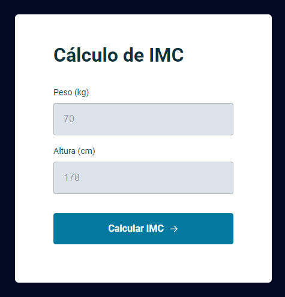
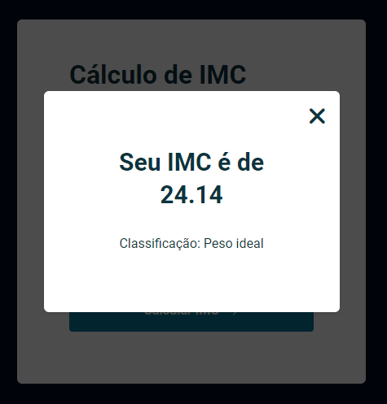

<h1 align="center"> Calculadora IMC </h1>

## Projeto

Este projeto foi desenvolvido para aplicar habilidades em JavaScript, HTML e CSS, resultando em uma aplicação para cálculo de massa corporal. 

   
  

## Tecnologias
- HTML
- CSS
- JavaScript

Projeto criado a partir de um desafio do nível 5 do Explorer da Rocketseat.